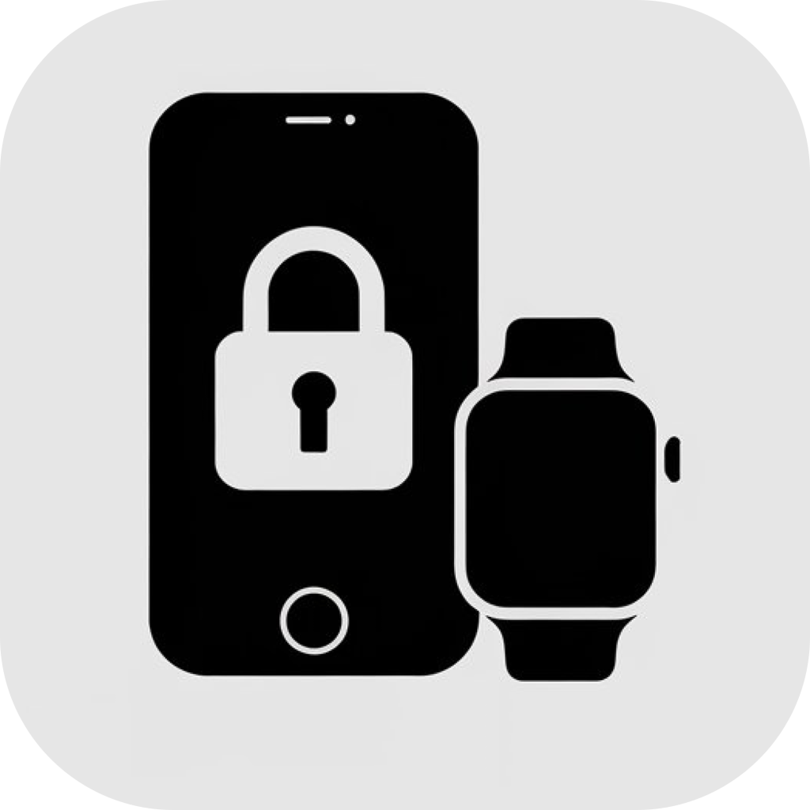
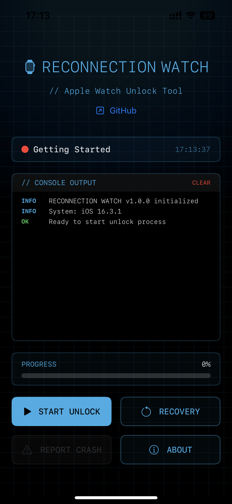
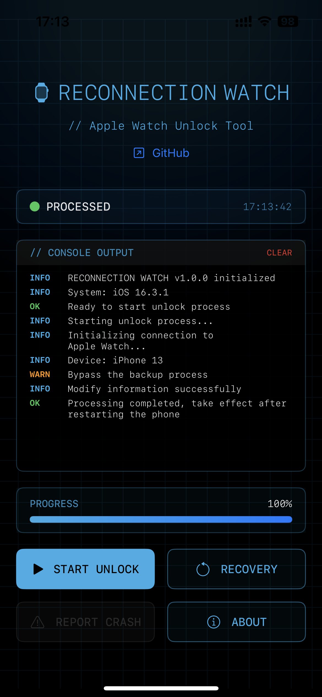

<h3>UnlockWatch</h3>

Seamlessly connect newer versions of watchOS with older iOS devices  

<a href="https://github.com/ResistanceTo/Unlock-Watch/releases">⬇️ Download</a>

 

## 💬 Languages

[English](readme.md) | [简体中文](readme_zh-Hans.md)

## 🔧 What is UnlockWatch?

**UnlockWatch** is a utility tool designed to help older versions of **iOS** unlock compatibility with newer versions of **watchOS**. Perfect for users who rely on jailbreak or tools like **TrollStore**, it bridges the version gap that Apple normally enforces between iPhone and Apple Watch.

## 🧪 Tested On

- **iPhone 13**  
  iOS: **16.3.1**  
  watchOS: **11.3**

- **iPhone Xs**  
  iOS: **16.4.1**  
  watchOS: **11.3**

## ✅ Requirements

- **iOS 15.0 or later**
- Requires **TrollStore** or a **jailbroken environment**

## 💡 Key Features

- Pair Apple Watches running **newer watchOS versions** with **older iPhones**
- Bypass version restrictions that typically prevent pairing
- Easy to install and use for jailbreak users

## 📎 Notes

- Functionality may vary depending on device model and iOS/watchOS version
- Use at your own risk – recommended for advanced users or developers

## 🗣️ Feedback & Contributions

Found a bug or have an idea? [Open an issue](https://github.com/ResistanceTo/Unlock-Watch/issues) or contribute to the project!

## 📱 User Interface

  
  

